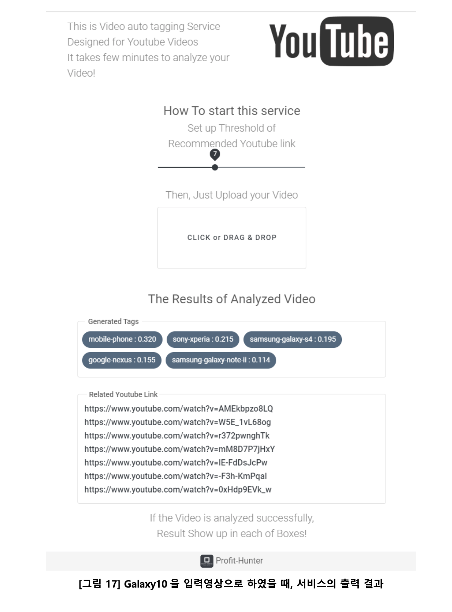
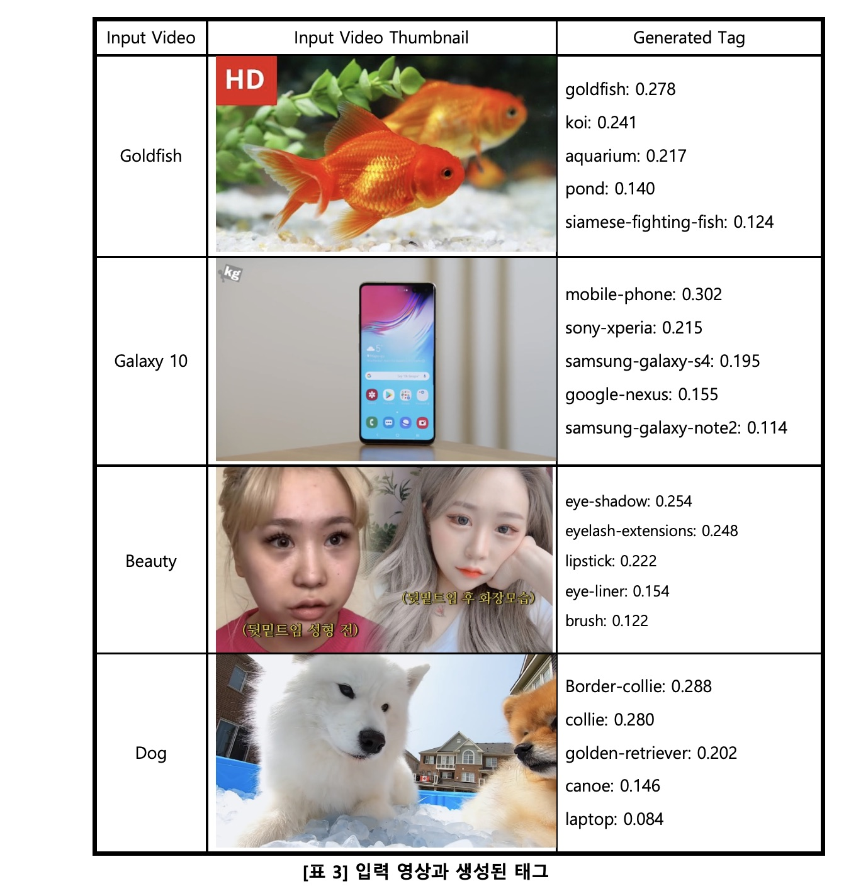

# youtube-video-recommender

## Overview
* KCC 2020 Poster 세션 참여작
* 임의의 영상을 입력받아 내용 상 유사한 유튜브 영상을 추천해 주는 모듈
* 영상에서 태그를 추출하고, 각 태그를 워드 벡터화한 후 전부 합쳐 비디오 벡터 생성, 각 비디오 벡터 간의 유사도 분석
* 2020-1 경희대학교 컴퓨터공학과 캡스톤디자인1 프로젝트(Team _Profit-Hunter_)

## Demo Guideline
1. Clone this repo
2. Set file paths on `src/esot3ria/inference_pb.py`
3. Run `inference_pb.py`

## Requirements
* Numpy
* Tensorflow 1.x
* Gensim

## Details
* 샘플 모델은 Youtube 8M 2nd Dataset(1/10 Scaled)으로 학습됨
* 영상 추천은 Youtube 8M 3rd Dataset의 Validation data로 진행됨 
* 입력할 영상은 mediapipe를 이용해 사전에 피쳐맵(.pb) 형태로 변환 필요 (`src/esot3ria/feauremaps` 아래 예시)
* 워드 벡터 모델(`tag_vectors.model`), 비디오 벡터 모델(`video_vectors.model`) 각각 사용
* 비디오 벡터의 구체적인 연산 방법은 소논문 및 보고서 참조

## Experiment Examples

